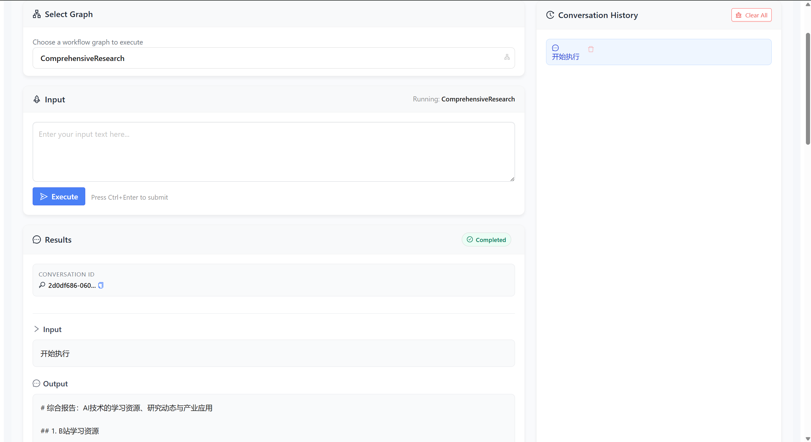
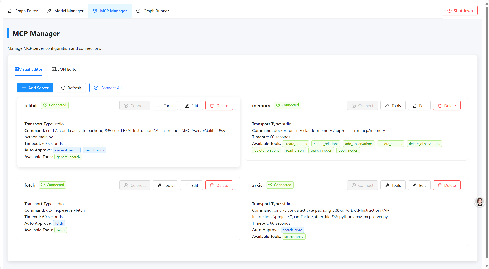

## MCP Agent Graph (MAG)

English | [中文](README_CN.md)

MCP Agent Graph (MAG) is an agent development framework for rapidly building agent systems. This project uses graphs, nodes, and MCP to quickly construct complex Agent systems.

### ✨ Core Features

#### 1️⃣ Graph-Based Agent Development Framework
Provides an intuitive visual environment for easily designing and building complex agent systems.

#### 2️⃣ Nodes as Agents
Each node in the graph is an independent agent that can leverage MCP server tool capabilities to complete specific tasks.

#### 3️⃣ Graph Nesting (Layered Worlds)
Supports using entire graphs as nodes within other graphs, enabling hierarchical agent architectures and creating "worlds within worlds."

#### 4️⃣ Graph to MCP Server Conversion
Export any graph as a standard MCP server Python script, allowing it to be called as an independent tool by other systems.

**Contributions welcome!** We invite everyone to join us in developing and building this project. Your contributions will help make MAG even better!

<details>
<summary>🌐 System Architecture</summary>

MAG follows a HOST-CLIENT-SERVER architecture:
- **HOST**: Central service that manages graph execution and coordinates communication between components
- **CLIENT**: MCP client that interacts with MCP servers
- **SERVER**: MCP server that provides specialized tools and capabilities

```
HOST  → CLIENT  → SERVER 
(Graph) → (Agent) <==> (MCP Server)
```
</details>

## 🖼️ Feature Showcase

### Visual Agent Graph Editor
Visually create agent workflows by connecting nodes in a graph. Each node represents an agent with its own configuration, behaviors, and capabilities.





### MCP Server Integration
Enhance your agent capabilities through MCP servers. Each agent node can access specialized capabilities from multiple MCP servers, such as web search, code execution, data analysis, and more.




### Nested Graphs (Graph as Node)
Build hierarchical agent systems by using entire graphs as nodes within larger graphs. This creates modular, reusable agent components, enabling a "worlds within worlds" architecture.

> This is a nested doll feature 😉


### Graph to MCP Server Export
Export any graph as a standalone MCP server that can be used as a tool by other agents or applications. This feature converts your agent graph into a reusable service that can be composed into larger systems.

> This is a nested doll within a nested doll feature 😉


## 🚀 Deployment Guide

### Backend Deployment

#### Option 1: Using Conda

```bash
# Create and activate conda environment
conda create -n mag python=3.11
conda activate mag

# Clone repository
git clone https://github.com/yourusername/mcp-agent-graph.git
cd mcp-agent-graph

# Install dependencies
pip install -r requirements.txt

# Run main application
python main.py
```

#### Option 2: Using uv

```bash
# If you don't have uv, install it first
Installation guide: https://docs.astral.sh/uv/getting-started/installation/

# Clone repository
git clone https://github.com/yourusername/mcp-agent-graph.git
cd mcp-agent-graph

# Install dependencies
uv sync
.venv\Scripts\activate.ps1 (powershell)
.venv\Scripts\activate.bat (cmd)

# Run directly with uv
uv run python main.py
```

The backend server will run on port 9999, and the MCP client will run on port 8765.

### Frontend Deployment

```bash
# Navigate to frontend directory
cd frontend

# Install dependencies
npm install

# Run development server
npm run dev
```

The frontend development server will run on port 5173.